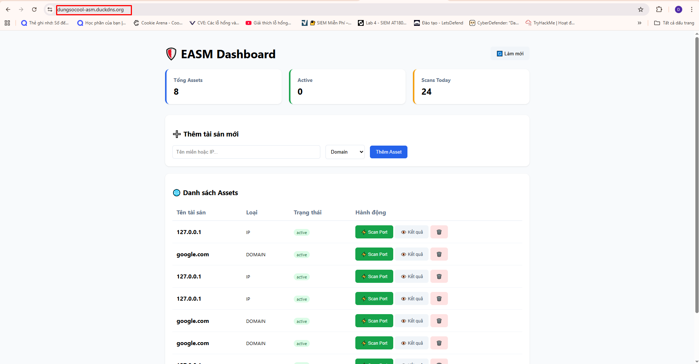
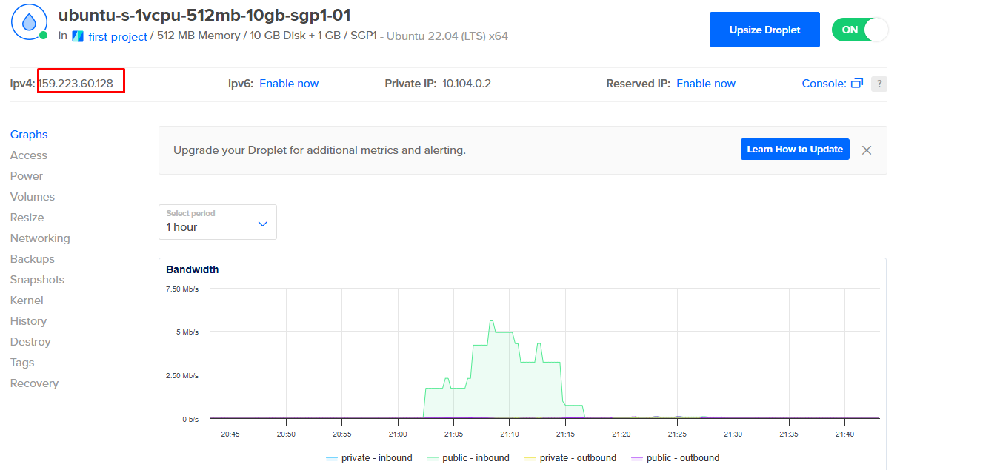
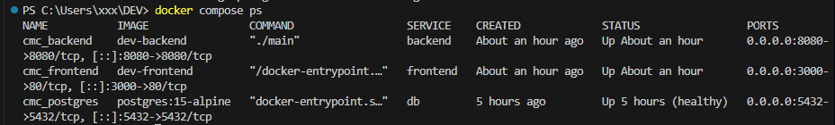
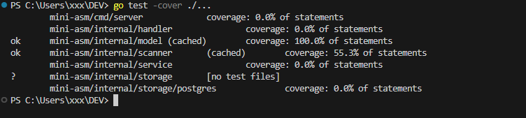
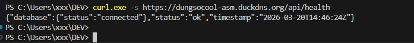
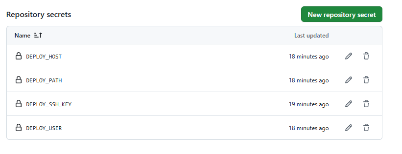
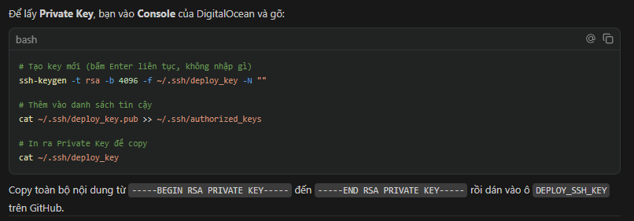
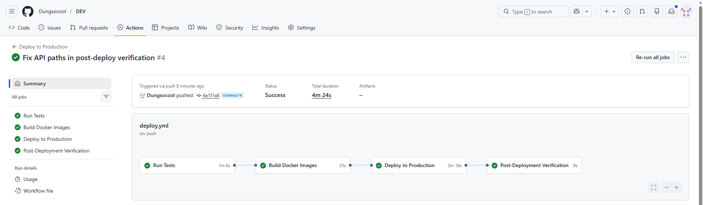
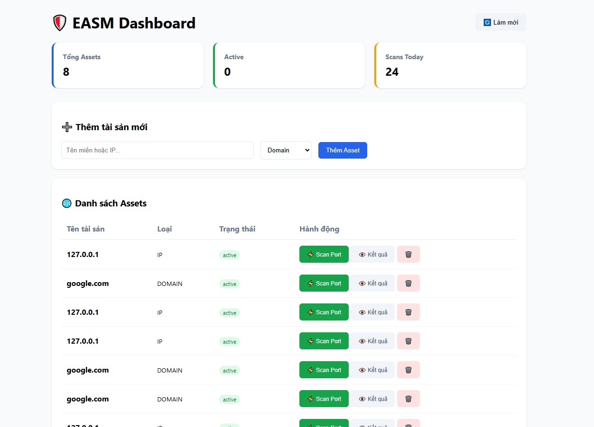

# 🛡️ External Attack Surface Management (EASM) System

This project is a comprehensive EASM (External Attack Surface Management) platform, combining a Go-based RESTful API backend with a Vite + ReactJS frontend dashboard. It enables IT asset management and security risk scanning.

The project strictly follows the **Clean Architecture** paradigm with Go (Golang) and ReactJS.

## 📝 Table of Contents
* [⚙️ Core Features](#features)
* [🛠️ Technologies & Libraries Used](#technologies)
* [📂 Directory Structure](#structure)
* [🔌 API Endpoints List](#api)
* [🚀 Installation & Running Guide](#install)
* [🧪 Testing & Deployment (Demo Outputs)](#test)

---

<a id="features"></a>
## ⚙️ Core Features

The system is comprehensively designed from backend to frontend, testing to DevOps:

1. **Core Asset Management (Base System):** Full CRUD operations, statistics, pagination, text search, and built-in connection Retry Backoff logic. Mitigates SQL Injection risks entirely using Parameterized Queries.
2. **Exercise 1 - EASM Scan Engine:** Built-in EASM scan engine that supports IP lookup (Geolocation & ASN), Port Scanning (TCP Open Ports), SSL Certificate monitoring, and Web Technology Stack detection.
3. **Exercise 2 - Integrated Unit Tests:** Scan modules (Scanners) and database models are fully equipped with Unit Tests to ensure code reliability and high coverage.
4. **Exercise 3 - Vite + ReactJS Frontend Dashboard:** Modern web interface interacting in real-time with the Go API, configured with secure CORS policies.
5. **Exercise 4 - CI/CD Security Pipeline:** Automatically audits code quality and scans for security vulnerabilities/secrets using major tools (Gosec, Gitleaks, Trivy, TruffleHog) on every Merge Request via GitHub Actions.
6. **Exercise 5 - Infrastructure as Code:** Easily spin up the entire database (PostgreSQL), Backend (Go), and Frontend (Vite/Nginx) multi-container services using a single command via Docker Compose.
7. **Exercise 6 - EASM Alerts API:** Automatically captures security vulnerabilities and threats from EASM scan results, feeding them into alert models with priority filtering and status tracking.
8. **Exercise 7 - Cloud Deployment:** Production-ready live operation hosted continuously on a DigitalOcean Cloud Droplet (Ubuntu 22.04 LTS).
9. **Exercise 8 - Dynamic Domain & TLS/HTTPS:** Configured Nginx web server with dynamic DNS (DuckDNS) and Let's Encrypt SSL/TLS certificates, enforcing secure HTTPS access at: `https://dungsocool-asm.duckdns.org`
10. **Exercise 9 - Auto-Deploy on Merge (CD Pipeline):** Automated SSH pipeline that pulls the latest source code and rebuilds containers whenever commits are merged into the `main` branch via GitHub Actions.

<a id="technologies"></a>
## 🛠️ Technologies & Libraries Used

| Component | Technology |
| :--- | :--- |
| Backend | Go (Golang), gorilla/mux |
| Frontend | ReactJS, Vite |
| Database | PostgreSQL 15 |
| Containerization | Docker, Docker Compose |
| CI/CD | GitHub Actions (`ci.yml` + `deploy.yml`) |
| Security Scanning | Gosec, Gitleaks, Trivy, TruffleHog |
| Web Server | Nginx + Certbot (Let's Encrypt) |
| Cloud | DigitalOcean Droplet (Ubuntu 22.04 LTS) |
| DNS | DuckDNS (Dynamic DNS) |
| Architecture | Clean Architecture: Handler ➡️ Service ➡️ Storage |

<a id="structure"></a>
## 📂 Directory Structure

Conforms to Clean Architecture:

```text
├── .github/
│   └── workflows/
│       ├── ci.yml              # Security CI pipeline (Gosec, Gitleaks, Trivy, TruffleHog)
│       └── deploy.yml          # CD automatic deployment pipeline on merge
├── cmd/
│   └── server/
│       └── main.go             # Entry point: db, router, services & server initialization
├── frontend/
│   ├── index.html              # Vite + ReactJS dashboard homepage
│   └── Dockerfile              # Dockerfile using Nginx to serve static files
├── internal/
│   ├── handler/
│   │   ├── asset_handler.go    # REST API for CRUD Assets & Scans
│   │   ├── alert_handler.go    # REST API for Alerts management
│   │   ├── health_handler.go   # Health check endpoint
│   │   └── middleware.go       # CORS middleware for Frontend
│   ├── model/
│   │   ├── asset.go            # Asset, APIResponse, ScanJob data structures
│   │   ├── alert.go            # Alert, AlertStats data structures
│   │   └── alert_test.go       # Unit tests for Alert models
│   ├── scanner/
│   │   ├── ip_scanner.go       # IP Recon (Geolocation, ASN)
│   │   ├── port_scanner.go     # Port Scan (TCP Open Ports)
│   │   ├── ssl_scanner.go      # SSL certificate check
│   │   ├── tech_scanner.go     # Web tech stack identification
│   │   └── *_test.go           # Unit tests for scanners
│   ├── service/
│   │   ├── asset_service.go    # Asset business logic
│   │   ├── scan_service.go     # Scan coordinator business logic
│   │   └── alert_service.go    # Alert business logic
│   └── storage/
│       ├── storage.go          # Storage interface definition
│       └── postgres/
│           ├── postgres.go     # DB Connection with retry backoff config
│           ├── alert_storage.go # PostgreSQL CRUD operations for Alerts
│           ├── delete_storage.go # Bulk Delete with parameterized queries
│           └── migrations/     # Database migration scripts
├── docs/images/                # Verification screenshots
├── docker-compose.yml          # Configuration for backend, frontend & db containers
├── Dockerfile                  # Multi-stage build for Go backend
└── README.md
```

<a id="api"></a>
## 🔌 API Endpoints List

### Assets API

| Method | Endpoint | Description | Example |
| :--- | :--- | :--- | :--- |
| `GET` | `/health` | Check health status of Server & DB | `curl localhost:8080/health` |
| `POST` | `/assets` | Create a new asset | Body: `{"name":"Server","type":"ip","value":"1.1.1.1"}` |
| `GET` | `/assets` | Retrieve paginated list of assets | `?page=1&limit=20` |
| `POST` | `/assets/batch` | Create multiple assets concurrently | Body: `[{...},{...}]` |
| `DELETE` | `/assets/batch` | Bulk delete assets | `?ids=id1,id2` |
| `GET` | `/assets/stats` | Retrieve total asset stats | - |
| `GET` | `/assets/search` | Search assets | `?q=server` |

### Scan API

| Method | Endpoint | Description | Example |
| :--- | :--- | :--- | :--- |
| `POST` | `/assets/{id}/scan` | Trigger EASM scan | Body: `{"scan_type":"port"}` |
| `GET` | `/scan-jobs/{id}/results` | Retrieve scan analysis results | - |

### Alerts API

| Method | Endpoint | Description |
| :--- | :--- | :--- |
| `GET` | `/alerts` | Get all alerts (paginated, filtered by severity) |
| `GET` | `/assets/{id}/alerts` | Get alerts specific to a certain asset |
| `GET` | `/alerts/stats` | Get alert statistics by type and severity |
| `PUT` | `/alerts/{id}/status` | Update alert status (open/resolved/dismissed) |

<a id="install"></a>
## 🚀 Installation & Running Guide

### Requirements
- Docker & Docker Compose (v2+)
- Go 1.21+ (for Dev Mode)
- Node.js 18+ (for Dev Mode)

### Method 1: Using Docker Compose (Recommended)
Run a single command in the project root:
```bash
docker compose up -d --build
```
This automatically:
- Starts PostgreSQL 15 with health checks.
- Builds the Go backend binary using a multi-stage Dockerfile.
- Builds and serves the ReactJS frontend through Nginx.
- Sets up networks and links all services together.

Access:
- Frontend Dashboard: `http://localhost:3000` (Local) or `https://dungsocool-asm.duckdns.org` (Production)
- Backend API: `http://localhost:8080` (Local) or `https://dungsocool-asm.duckdns.org/api` (Production)

### Method 2: Development Mode (Dev Mode)
```bash
# 1. Spin up Database only
docker compose up -d db

# 2. Run Backend (Terminal 1)
go run cmd/server/main.go

# 3. Run Frontend (Terminal 2)
cd frontend
npm install
npm run dev
```

### Supported Environment Variables
| Variable | Default | Description |
| :--- | :--- | :--- |
| `DB_HOST` | `localhost` | PostgreSQL host |
| `DB_PORT` | `5432` | PostgreSQL port |
| `DB_USER` | `postgres` | Database username |
| `DB_PASSWORD` | `postgres` | Database password |
| `DB_NAME` | `postgres` | Database name |

---

<a id="test"></a>
## 🧪 Testing & Deployment (Demo Outputs)

### 1. Cloud & HTTPS Live Operation
The system is configured production-ready using an Nginx Reverse Proxy with secure HTTPS:
```text
Access URL:    https://dungsocool-asm.duckdns.org
SSL Issuer:    Let's Encrypt Authority R3
Server IP:     159.223.60.128
Cloud Host:    DigitalOcean Droplet (Ubuntu 22.04 LTS, 512MB RAM, SGP1)
```



### 2. Docker Container Status
```text
NAME           IMAGE                COMMAND     SERVICE    STATUS             PORTS
cmc_backend    dev-backend          "./main"    backend    Up 19 minutes      0.0.0.0:8080->8080/tcp
cmc_frontend   dev-frontend         "nginx..."  frontend   Up 19 minutes      0.0.0.0:3000->80/tcp
cmc_postgres   postgres:15-alpine   "docker..."   db         Up 4 hrs (healthy) 0.0.0.0:5432->5432/tcp
```


### 3. Unit Tests Code Coverage
```text
$ go test -cover ./...
ok      mini-asm/internal/model         0.036s  coverage: 100.0% of statements
ok      mini-asm/internal/scanner       7.051s  coverage: 55.3% of statements
```


### 4. HTTPS API Health Check
```json
$ curl.exe -s https://dungsocool-asm.duckdns.org/api/health
{"database":{"status":"connected"},"status":"ok","timestamp":"2026-03-20T14:46:24Z"}
```


### 5. CI/CD & Auto Deploy Pipeline
Whenever commits are merged into `main`, GitHub Actions automatically audits source code (Gosec, Gitleaks, Trivy, TruffleHog) and deploys directly via SSH to the Droplet:
```text
Workflow:  Deploy to Production / mini-asm Security CI
Pipeline:  Build ➡️ Test ➡️ Security Check ➡️ Deploy ➡️ Post-Deploy Verification
Status:    Success 🎉
```




### 6. Frontend UI Dashboard
Open a browser and navigate to `http://localhost:3000` or `https://dungsocool-asm.duckdns.org`. The dashboard visualizes assets, allows adding new targets, launching EASM scans (IP/Port/SSL/Tech), and checking details/alerts.


---
*The project is secured via Gosec, Gitleaks, Trivy, and TruffleHog, and blocks SQL Injection via Parameterized Queries.*
